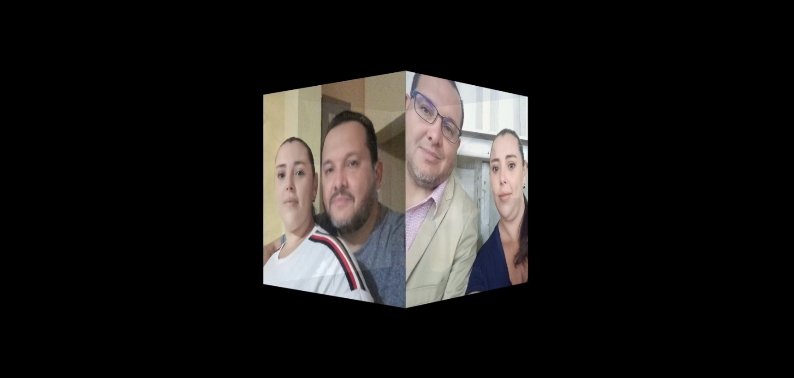

Cuadro de Fotos
Este proyecto consiste en una aplicación web simple que muestra una galería de fotos en un diseño de cuadrícula. Las imágenes se pueden cargar desde una ubicación local y se presentan de manera organizada y estética en la página web.

Funcionalidades
Carga de imágenes: Los usuarios pueden cargar imágenes desde su dispositivo local para agregarlas a la galería.

Presentación en cuadrícula: Las imágenes se muestran en una cuadrícula, lo que permite una visualización ordenada y eficiente de las fotos.

Interfaz intuitiva: La interfaz de usuario es fácil de usar, lo que permite una navegación fluida y sin complicaciones para los usuarios.

Uso
Clonar el repositorio: Clona este repositorio en tu máquina local usando el siguiente comando:

bash
Copy code
git clone https://github.com/lcastillo24/Cuadro-de-Fotos.git
Abrir el archivo HTML: Una vez clonado el repositorio, abre el archivo index.html en tu navegador web preferido.

Cargar imágenes: Haz clic en el botón de carga e selecciona las imágenes que deseas agregar a la galería.

Visualizar la galería: Una vez que se han cargado las imágenes, podrás verlas organizadas en una cuadrícula en la página web.

Contribución
Las contribuciones son bienvenidas y apreciadas. Si deseas contribuir a este proyecto, por favor sigue estos pasos:

Haz un fork del repositorio.
Crea una nueva rama (git checkout -b feature/nueva-caracteristica).
Realiza tus cambios y haz commit de ellos (git commit -am 'Agrega nueva característica').
Haz push de tu rama al repositorio (git push origin feature/nueva-caracteristica).
Abre un Pull Request.
Tecnologías utilizadas
HTML5
CSS3
JavaScript
Créditos
Este proyecto fue desarrollado por Laura Castillo Salas.

Licencia
Este proyecto está bajo la Licencia Laura Castillo. Consulta el archivo LICENSE para obtener más detalles.
